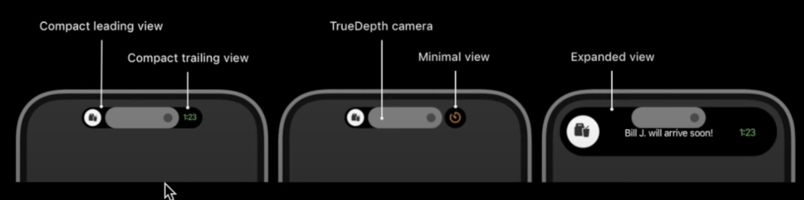
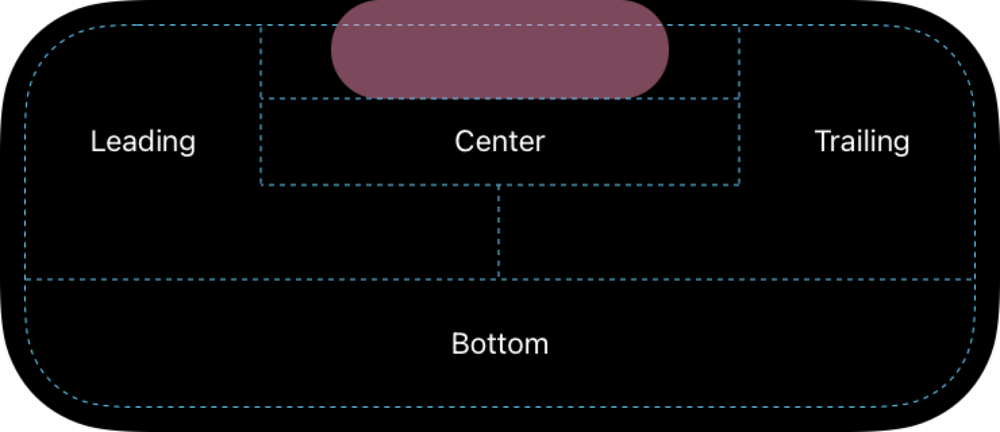
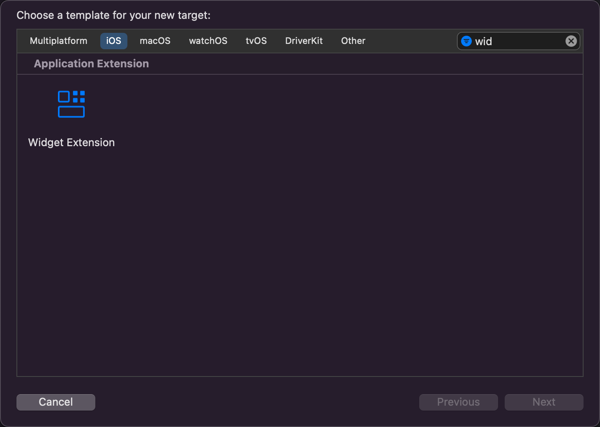
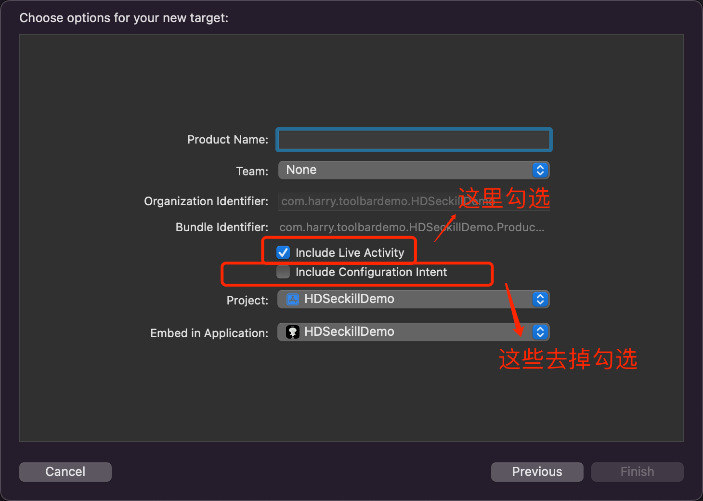
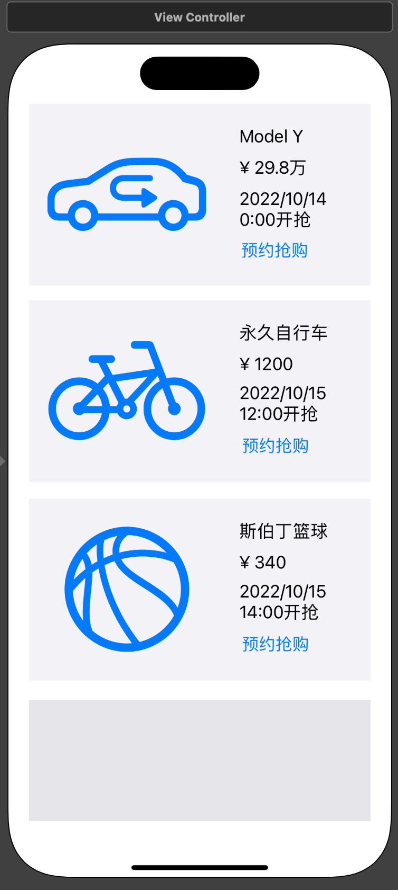

## iOS灵动岛开发实践

### 一、基本概述

#### 名词基础知识

> 苹果在 iPhone 14 Pro 系列中增加一个灵动岛，主要目的是隐藏挖孔造型的高端“感叹号屏”。 通过动画的视觉差异，用户找不到原来的挖孔屏。灵动岛是一种巧妙的设计，模糊了软件和硬件之间的界限，它可以在**锁屏的情况**下根据不同的应用程序操作和提示、通知和活动内容的需求，自动改变大小和形状，展示用户关注的事情。






#### 开发基础知识

> 1、设备只支持iPhone，并且是有“药丸屏”的iPhone14Pro和14Pro Max上；
>
> 2、Max系统版本、编译器及iOS系统版本：>=MacOS12.4、>=Xcode14.0+beta4、>=iOS16.1+beta；
>
> 3、使用 `ActivityKit` 用于配置、开始、更新、结束实现 `Live Activity` 能力。使用 `WidgetKit` 、`SwiftUI` 在`widget` 小组件中创建  `Live Activity` 的用户界面，这样小组件和  `Live Activity` 的代码是可以共享；
>
> 4、`Live Activity` 目前只能通过  `ActivityKit`  从主工程获取数据，或者从 远程通知 获取最新数据；无法访问网络或者接受位置更新信息
>
> 5、 `ActivityKit`  和 远程通知推送 更新的数据不能超过4KB；
>
> 6、`Live Activity` 可以给不同的控制绑定不同的 deeplink，使其跳转到不同的页面；
>
> 7、`Live Activity` 在用户主动结束前最多存活8小时；
>
> 8、已经结束的 `Live Activity`  在锁屏也最多保留4小时，所以一个 `Live Activity`  最长可以停留12小时；
>
> 9、最多同时存在两组 `Live Activity` ，排列顺序待发现


### 二、项目构思

这里以电商常用的抢购商品作为实践，包含的交互方式主要有如下特征：

1、主工程商品能展示基本信息，包含图片、名称、价格、开抢时间、预约按钮等；

2、主工程记录商品预约状态及灵动岛的任务状态，避免重复预约；

3、开启预约后，在打开App的情况下，灵动岛看到该商品的基本信息，支持立即抢购；


包含了开发灵动岛的基础知识：

1、主工程数据通过  `ActivityKit`  来启动、更新、停止灵动岛 Widget；

2、灵动岛 Widget 的基本布局方式及开发注意事项；

3、灵动岛 Widget 点击跳转到主工程的事件通讯；


### 二、效果展示


### 四、代码实践

#### 1、创建主工程及灵动岛Widget工程



 

在主工程的 `info.plist` 文件中添加 `Supports Live Activities` 并且设置为 `YES`


#### 2、熟悉 `ActivityKit` 常用对象及API，创建基本视图

**数据部分（主工程）**：继承 `ActivityAttributes` ，定义常用的数据来控制或改变UI及状态。这里包含的商品的基本信息，可以认为是不变的状态，可变的状态需要在 `ContentState` 中声明。

```swift
// SeckillProduct.swift

import Foundation
import ActivityKit

struct SeckillProductAttributes: ActivityAttributes {
    typealias SeckillProductState = ContentState
    public struct ContentState: Codable, Hashable {
	      // 可变的属性需要放在这里，activity调用update进行数据的更新
        var isSeckill: Bool
    }
    
    // 一个灵动岛任务的初始化数据，描述一些不可变数据
    let productId: String
    let name: String
    let price: String
    let image: String
    let countDown: Double
    let isSeckill: Bool
    
    init(productId: String, name: String,  price: String, image: String, countDown: Double, isSeckill: Bool = false) {
        self.productId = productId
        self.name = name
        self.price = price
        self.image = image
        self.countDown = countDown
        self.isSeckill = isSeckill
    }
}
```

**灵动岛布局（Widget工程）**：继承 `Widget` ，通过 `ActivityConfiguration` 来管理锁屏及灵动岛的布局。

这里包含了如何从主工程获取数据展示及将点击事件传递给主工程的代码示例：

```swift
// HDSeckillAvtivityLiveActivity.swift

import ActivityKit
import WidgetKit
import SwiftUI

struct HDSeckillAvtivityLiveActivity: Widget {
    var body: some WidgetConfiguration {
        ActivityConfiguration(for: SeckillProductAttributes.self) { context in
            // 锁屏之后，显示的桌面通知栏位置，这里可以做相对复杂的布局
            VStack {
                Text("Hello").multilineTextAlignment(.center)
            }
            .activityBackgroundTint(Color.cyan)
            .activitySystemActionForegroundColor(Color.black)
            
        } dynamicIsland: { context in
            // 灵动岛的布局代码
            DynamicIsland {
                /*
                 这里是长按灵动岛区域后展开的UI
                 有四个区域限制了布局，分别是左、右、中间（硬件下方）、底部区域
                 这里采取左边为App的Icon、右边为上下布局（商品名称+商品图标）、
                 中间为立即购买按钮，支持点击deeplink传参唤起App、
                 底部为价格和倒计时区域
                 */
                DynamicIslandExpandedRegion(.leading) {
                    Image("zyg100").resizable().frame(width: 32, height: 32)
                }
                DynamicIslandExpandedRegion(.trailing) {
                    Text(context.attributes.name).font(.subheadline).multilineTextAlignment(.center)
                    Spacer(minLength: 8)
                    Image(systemName: context.attributes.image).multilineTextAlignment(.center)
                }
                DynamicIslandExpandedRegion(.center) {
                    // 这里的url一定记得需要中文编码
                    let url = "hdSeckill://seckill?productId=\(context.attributes.productId)&name=\(context.attributes.name)".addingPercentEncoding(withAllowedCharacters: .urlQueryAllowed)!
                    Link("立即购买", destination: URL(string: url)!).foregroundColor(.red).font(.system(size: 24, weight: .bold))
                }
                DynamicIslandExpandedRegion(.bottom) {
                    VStack(alignment: .center, content: {
                        Spacer(minLength: 8)
                        Text("价格\(context.attributes.price)").font(.subheadline)
                        Spacer(minLength: 8)
                        Text(Date().addingTimeInterval(context.attributes.countDown * 60), style: .timer).font(.system(size: 16, weight: .semibold)).multilineTextAlignment(.center)
                        
                    }).foregroundColor(.green)
                }
            } compactLeading: {
                // 这里是灵动岛未被展开左边的布局，这里用来展示App的Icon
                Image("zyg100").resizable().frame(width: 32, height: 32)
            } compactTrailing: {
                // 这里是灵动岛未被展开右边的布局，这里用来商品的名称
                HStack {
                    Text(context.attributes.name).font(.subheadline)
                }
            } minimal: {
                // 这里是灵动岛有多个任务的情况下，展示优先级高的任务，位置在右边的一个圆圈区域
                // 这用户展示商品的图标
                Image(systemName: context.attributes.image)
            }
            // 点击整个区域，通过deeplink将数据传递给主工程，做相应的业务
            .widgetURL(URL(string: "http://www.apple.com"))
            .keylineTint(Color.red)
        }
    }
}
```

#### 3、在主工程做好基本布局及初始化商品数据

**（主工程）**布局部分因为demo展示，直接使用 `storyboard` 快速完成：



```swift
// ViewController.swift
private func initProducts() {
        let carId = "2022101101"
        let carIsSeckill = checkIsSeckill(productId: carId)
        let bicycleId = "2022101102"
        let bicycleIsSeckill = checkIsSeckill(productId: bicycleId)
        let basketballId = "2022101103"
        let basketballIsSeckill = checkIsSeckill(productId: basketballId)
        let car = SeckillProductAttributes(productId:carId, name: "Model Y", price: "29.8万", image: "car.side.air.circulate", countDown: 60, isSeckill: carIsSeckill)
        let bicycle = SeckillProductAttributes(productId:bicycleId, name: "永久自行车", price: "1200", image: "bicycle", countDown: 120, isSeckill: bicycleIsSeckill)
        let basketball = SeckillProductAttributes(productId:basketballId, name: "斯伯丁篮球", price: "340", image: "basketball", countDown: 150, isSeckill: basketballIsSeckill)
        products.append(car)
        products.append(bicycle)
        products.append(basketball)
        
			  // 判断本地缓存和系统ActiviKit的任务数据来显示当前列表
        if carIsSeckill {
            seckillButton0.setTitle("已预约", for: .normal)
        }
        if bicycleIsSeckill {
            seckillButton1.setTitle("已预约", for: .normal)
        }
        if basketballIsSeckill {
            seckillButton2.setTitle("已预约", for: .normal)
        }
    }
```

点击事件，调用 `ActivityKit` 将数据传递给 灵动岛 Widget：

```swift
// ViewController.swift
@IBAction func seckillAction(_ sender: UIButton) {
        if sender.tag >= products.count {
            return
        }
        
        if !ActivityAuthorizationInfo().areActivitiesEnabled {
            logToTextView(log: "不支持灵动岛")
            return
        }
        
        let product = products[sender.tag]
        // 判断系统的activities是否还执行该商品的任务，只有是在执行中的，才进行取消操作
        if sender.titleLabel?.text == "已预约" {
            if let activityId = getSeckillActivityId(productId: product.productId) {
                for activity in Activity<SeckillProductAttributes>.activities where activity.id == activityId {
                    logToTextView(log: "取消预约购买\(product.name)")
                    Task {
                        await activity.end(dismissalPolicy:.immediate)
                    }
                    sender.setTitle("预约抢购", for: .normal)
                }
            }
            return
        }
        
        logToTextView(log: "开始预约购买\(product.name)")
        do {
            // 初始化状态，ContentState是可变的对象
            let initState = SeckillProductAttributes.ContentState(isSeckill: true)
            // 初始化状态，这里是不变的数据
            let activity = try Activity.request(attributes: product, contentState: initState)
            logToTextView(log: "activityId: \(activity.id)")
            sender.setTitle("已预约", for: .normal)
            // 将商品id和活动id关联起来，方便查询及取消操作
            saveSeckillState(productId: product.productId, activityId: activity.id)
        } catch {
            
        }
    }
```

同步管理活动数据及系统activities的状态：

```swift
// ViewController.swift
extension ViewController {
    // 保留商品的预约状态，key是商品id，value是activity的id
    static let seckillProductIds = "com.harry.toolbardemo.seckillProductIds"
    
    private func checkIsSeckill(productId: String) -> Bool {
        if let ids = UserDefaults.standard.value(forKey: ViewController.seckillProductIds) as? [String: String] {
            // 本地缓存包含该商品ID，并且系统的Activity依旧存在
            if ids.keys.contains(productId) {
                for activity in Activity<SeckillProductAttributes>.activities where activity.id == ids[productId] {
                    return true
                }
            }
        }
        return false
    }
    
    private func saveSeckillState(productId: String, activityId: String) {
        var ids = [String: String]()
        if let tempIds = UserDefaults.standard.value(forKey: ViewController.seckillProductIds) as? [String: String] {
            ids = tempIds
        }
        ids[productId] = activityId
        UserDefaults.standard.set(ids, forKey: ViewController.seckillProductIds)
    }
    
    private func getSeckillActivityId(productId: String) -> String? {
        if let ids = UserDefaults.standard.value(forKey: ViewController.seckillProductIds) as? [String: String] {
            return ids[productId]
        }
        return nil
    }
    
    private func removeSeckillActivityId(productId: String) {
        if var ids = UserDefaults.standard.value(forKey: ViewController.seckillProductIds) as? [String: String] {
            ids.removeValue(forKey: productId)
            UserDefaults.standard.set(ids, forKey: ViewController.seckillProductIds)
        }
    }
}
```

#### 4、解析灵动岛 Widget的数据，并且做相应的操作

**（主工程中）**外部唤起会执行到 `SceneDelegate` 或者 `AppDelegate` 的系统API中，这里以 ``SceneDelegate`` 为例说明：

```swift
// SceneDelegate.swift

// 实现该方法，接收并且处理外部唤起的数据做相应的事件
func scene(_ scene: UIScene, openURLContexts URLContexts: Set<UIOpenURLContext>) {
    if let url = URLContexts.first?.url {
        debugPrint("url: \(url)")
        if url.scheme == "hdSeckill" {
            // 通过scheme来区分灵动岛相关的数据
            ActivityBrigde.activityAction(url: url)
        }
    }
}

// SeckillProduct.swift
// 解析灵动岛的传递数据，做相应的事件，这里通过通知给主工程的控制器执行相应任务
struct ActivityBrigde {
    @discardableResult
    public static func activityAction(url: URL) -> Bool {
        let host = url.host
        guard host != nil else { return false }
        let queryItems = URLComponents(string: url.absoluteString)?.queryItems
        guard let queryItems = queryItems else { return false }
        var productId : String?
        var name : String?
        for item in queryItems {
            // 获取商品id和名称
            if item.name == "productId" {
                productId = item.value
            }
            else if item.name == "name" {
                name = item.value
            }
        }
        guard let productId = productId else { return false }
        debugPrint("立即抢购[\(name ?? "")] \(productId)")
        
        let info = [
            "productId": productId,
            "name": name ?? ""
        ]
        NotificationCenter.default.post(name: Notification.Name("liveActivityNotif"), object: nil, userInfo: info)
        
        return true
    }
}
```

**（主工程中）** 主控制器监听该通知，并且做相应的任务处理：

```swift
//  ViewController.swift

override func viewDidLoad() {
    super.viewDidLoad()
    NotificationCenter.default.addObserver(self, selector: #selector(liveActivityNotif(notif:)), name: Notification.Name("liveActivityNotif"), object: nil)
}

extension ViewController {
    @objc private func liveActivityNotif(notif: Notification) {
        if let userInfo = notif.userInfo {
            if let productId = userInfo["productId"] as? String, let name = userInfo["name"] as? String {
                logToTextView(log: "立即抢购[\(name)] \(productId) \n")
            }
        }
    }
    
    private func logToTextView(log: String) {
        debugPrint(log);
        logTextView.text.append("\(log) \n")
        logTextView.scrollRectToVisible(CGRect(x: 0, y: logTextView.contentSize.height - 10, width: logTextView.contentSize.width, height: 10), animated: true)
    }
}
```


### **五、小结**

整体的开发成本还是很低，基本上按照后文有几篇优秀的博客操作即可完成属于自己想法的灵动岛。之前没有接触过 `Widget` 和 `SwiftUI` 开发的iOS同学也不用担心。相信在不同类型的应用中，大家肯定也能够找到属于自己的灵感给用户更高的体验感。

本文涉及到的代码地址为 [HDSeckillDemo](https://github.com/erduoniba/HDSeckillDemo) 欢迎大家 🌟Star 🌟


### 六、参考链接

[ActivityKit官方文档](https://developer.apple.com/documentation/activitykit/displaying-live-data-with-live-activities)

[iOS 16 Live Activity](https://mp.weixin.qq.com/s/aKD-WBYHsepg96zOC378cg)

[iOS16.1灵动岛适配 (ActivityKit 初探)](https://juejin.cn/post/7144268555779850248)

[实时活动(Live Activity) - 在锁定屏幕和灵动岛上显示应用程序的实时数据](https://juejin.cn/post/7144268555779850248)

[Dynamic Island API - iOS 16.1 Beta - Xcode 14.1 - SwiftUI Tutorials](https://youtu.be/gEWvV-TmjqE)

[可能是全网第一个适配iOS灵动岛的Toast库-JFPopup](https://juejin.cn/post/7145630021372084232)